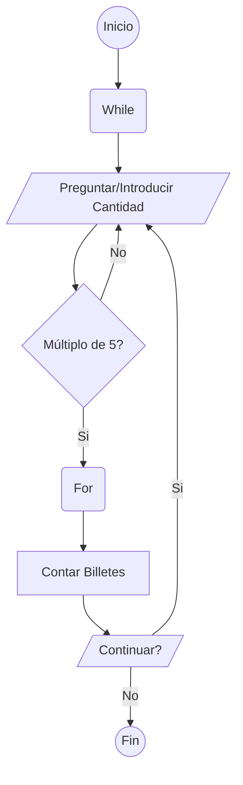

```mermaid

flowchart TB
    1((Inicio))
    2(While)
    3[/Preguntar/Introducir Cantidad/]
    3.5{Múltiplo de 5?}
    4(For)
    5[Contar Billetes]
    6[/Continuar?/]
    7((Fin))
    


1-->2
2-->3
3-->3.5
3.5-->|Si|4
3.5-->|No|3
4-->5
5-->6
6-->|Si|3
6-->|No|7


```
