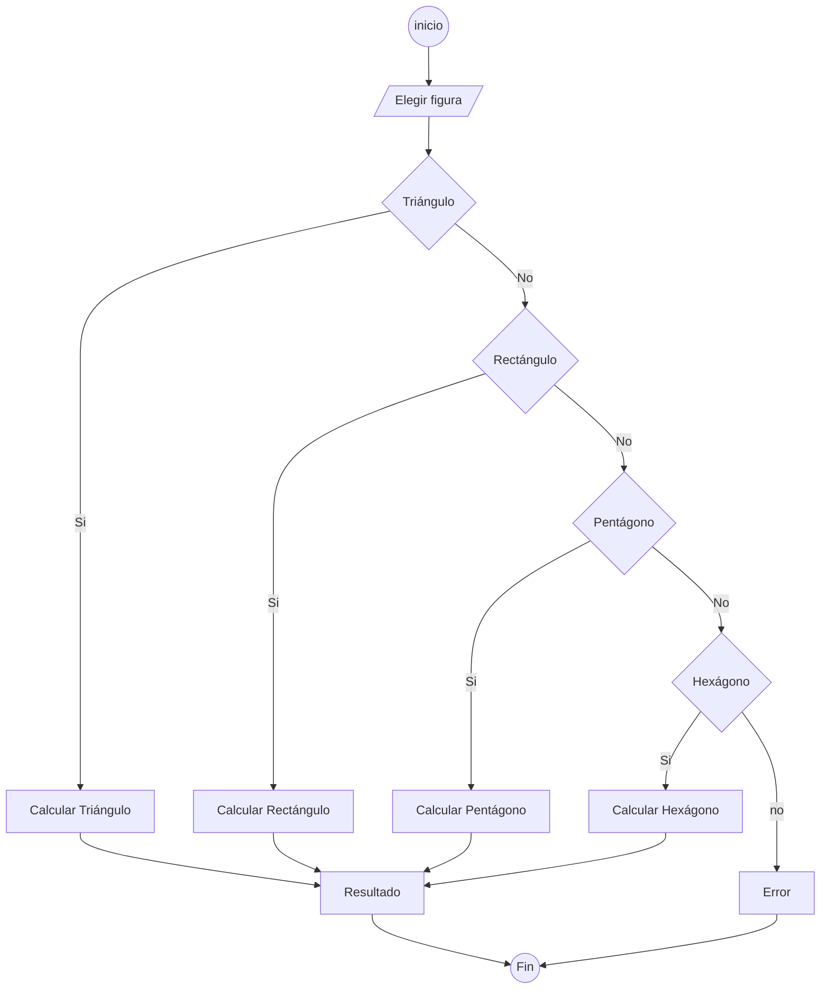

```mermaid

flowchart TB
    1((inicio))
    2[/Elegir figura/]
    3{Triángulo}
    3.5[Calcular Triángulo]
    4{Rectángulo}
    4.5[Calcular Rectángulo]
    5{Pentágono}
    5.5[Calcular Pentágono]
    6{Hexágono}
    6.5[Calcular Hexágono]
    7[Resultado]
    8[Error]
    9((Fin))
    
    
    
    
    
    
    1-->2
    2-->3
    3-->|Si|3.5
    3-->|No|4
    4-->|Si|4.5
    4-->|No|5
    5-->|Si|5.5
    5-->|No|6
    6-->|Si|6.5
    6-->|no|8
    3.5-->7
    4.5-->7
    5.5-->7
    6.5-->7
    7-->9
    8-->9
    
    
    
```

